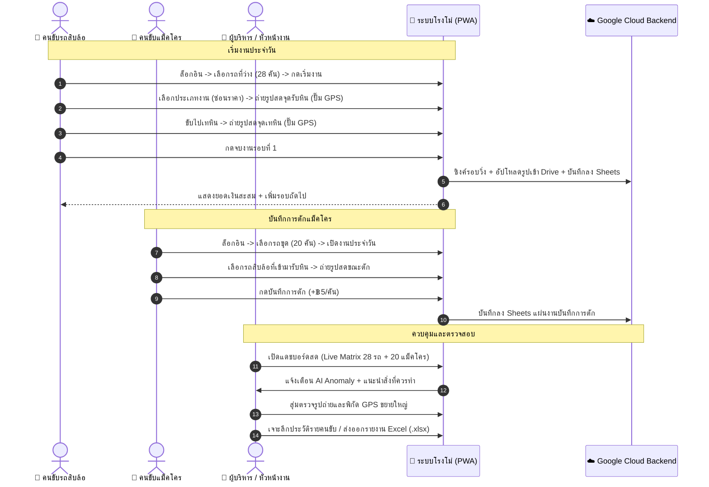

# พิมพ์เขียวระบบบริหารจัดการโรงโม่หินอัจฉริยะ
## (Quarry Fleet Management & AI Insights System Blueprint)
**เวอร์ชัน:** 2.0 (Production Release) | **สถานะ:** พร้อมใช้งาน (Ready for Production)  
**ผู้ออกแบบและพัฒนาระบบ:** AI Architecture Team  

---

## 📑 สารบัญ (Table of Contents)
1. [บทสรุปผู้บริหารและวัตถุประสงค์ของโครงการ](#1-บทสรุปผู้บริหารและวัตถุประสงค์ของโครงการ)
2. [สถาปัตยกรรมระบบโดยรวม (System Architecture)](#2-สถาปัตยกรรมระบบโดยรวม-system-architecture)
3. [กลไกความปลอดภัยและการป้องกันการทุจริต (Anti-Fraud & Security)](#3-กลไกความปลอดภัยและการป้องกันการทุจริต-anti-fraud--security)
4. [ระบบปัญญาประดิษฐ์อัจฉริยะ (AI Engine & Copilot)](#4-ระบบปัญญาประดิษฐ์อัจฉริยะ-ai-engine--copilot)
5. [บทบาทผู้ใช้และขั้นตอนการปฏิบัติงาน (User Roles & Workflows)](#5-บทบาทผู้ใช้และขั้นตอนการปฏิบัติงาน-user-roles--workflows)
6. [โครงสร้างฐานข้อมูลและโมเดลข้อมูล (Database Schema & Storage)](#6-โครงสร้างฐานข้อมูลและโมเดลข้อมูล-database-schema--storage)
7. [เครื่องยนต์คำนวณราคาและตรรกะทางธุรกิจ (Business Rules & Pricing Engine)](#7-เครื่องยนต์คำนวณราคาและตรรกะทางธุรกิจ-business-rules--pricing-engine)
8. [รายละเอียดโมดูลส่วนหน้า (Frontend UI/UX Modules)](#8-รายละเอียดโมดูลส่วนหน้า-frontend-uiux-modules)
9. [คู่มือการติดตั้งและการนำขึ้นระบบ 24 ชม. (Deployment & DevOps)](#9-คู่มือการติดตั้งและการนำขึ้นระบบ-24-ชม-deployment--devops)
10. [แผนการบำรุงรักษาและการรองรับอนาคต (Maintenance & Roadmap)](#10-แผนการบำรุงรักษาและการรองรับอนาคต-maintenance--roadmap)

---

## 1. บทสรุปผู้บริหารและวัตถุประสงค์ของโครงการ

ระบบบริหารจัดการโรงโม่หินอัจฉริยะ ถูกออกแบบและพัฒนาขึ้นเพื่อแก้ไขปัญหาคอขวด ความผิดพลาดจากเอกสารกระดาษ และความเสี่ยงในการทุจริตรอบวิ่งของยานพาหนะในโรงโม่หิน โดยมีขอบเขตการจัดการยานพาหนะและเครื่องจักรขนาดใหญ่:
* **รถบรรทุกสิบล้อ/พ่วง:** จำนวน 28 คัน (แบ่งตามขนาดพิกัด 30 ตัน, 45 ตัน, 60 ตัน)
* **รถขุด / แม็คโคร:** จำนวน 20 เครื่องจักร (ทั้งทีมประจำโรงโม่ และทีมผู้รับเหมาภายนอก)
* **คนขับและผู้ควบคุมเครื่องจักร:** รองรับมากกว่า 38 คน
* **ประเภทงานและเรทราคา:** รองรับเรทราคาตามระยะทางและประเภทหิน 11 รายการ

### วัตถุประสงค์หลัก 5 ประการ:
1. **Real-time Digital Operations:** เปลี่ยนระบบตั๋วเที่ยววิ่งกระดาษเป็นระบบบันทึกดิจิทัลผ่านสมาร์ทโฟน 100%
2. **Strict Anti-Fraud Guarantee:** บังคับถ่ายภาพสดหน้างานและปั๊มลายน้ำพิกัดดาวเทียม GPS + เวลาลงในเนื้อภาพ ป้องกันการนำรูปเก่ามาเวียนใช้
3. **Automated Driver Payroll:** คำนวณค่าจ้างตามเที่ยววิ่งและขนาดพิกัดตันแบบอัตโนมัติ แม่นยำ ไร้ข้อพิพาท
4. **AI Anomaly Detection:** มี AI คอยตรวจจับพฤติกรรมผิดปกติ เช่น รอบวิ่งเร็วเกินจริง พิกัดรับ-เทซ้ำซ้อน หรือรถจอดแช่
5. **Zero Infrastructure Cost:** ทำงานบน Google Cloud Platform (Google Apps Script + Google Sheets + Google Drive) ให้บริการ 24/7 ตลอดชีพโดยไม่มีค่าเช่าเซิร์ฟเวอร์รายเดือน

---

## 2. สถาปัตยกรรมระบบโดยรวม (System Architecture)

ระบบใช้สถาปัตยกรรม **Serverless Progressive Web Application (PWA)** ทำงานร่วมกับ Google Cloud Platform:

```
┌─────────────────────────────────────────────────────────────────────────────┐
│                            1. PRESENTATION LAYER                            │
│  ┌─────────────────────────┐ ┌─────────────────────────┐ ┌────────────────┐ │
│  │ 🚚 คนขับสิบล้อ (PWA)     │ │ 🚜 คนขับแม็คโคร (PWA)   │ │ 💼 ผู้บริหาร/  │ │
│  │ - เลือกรถ/สลับรถอิสระ   │ │ - เลือกเครื่องจักรประจำวัน│ │    หัวหน้างาน │ │
│  │ - ถ่ายสดจุดรับ-เท (ซ่อนเรท)│ │ - บันทึกการตักให้สิบล้อ │ │ - Live Matrix│ │
│  │ - กรองประวัติย้อนหลัง   │ │ - กรองประวัติย้อนหลัง   │ │ - AI Copilot │ │
│  └────────────┬────────────┘ └────────────┬────────────┘ └───────┬────────┘ │
└───────────────┼───────────────────────────┼──────────────────────┼──────────┘
                │                           │                      │
┌───────────────▼───────────────────────────▼──────────────────────▼──────────┐
│                           2. CLIENT-SIDE ENGINES                            │
│  ┌────────────────────────┐ ┌────────────────────────┐ ┌─────────────────┐  │
│  │ 📷 Camera & Watermark   │ │ 🧠 AI Anomaly & Chat   │ │ 💾 Offline Sync │  │
│  │ - HTML5 WebRTC / Video │ │ - Rule-based Inspector │ │ - LocalStorage  │  │
│  │ - Canvas Pixel Burner  │ │ - NL Query Assistant   │ │ - Auto-queue    │  │
│  └────────────┬───────────┘ └────────────┬───────────┘ └─────────┬───────┘  │
└───────────────┼──────────────────────────┼───────────────────────┼──────────┘
                │                          │                       │
┌───────────────▼──────────────────────────▼───────────────────────▼──────────┐
│                      3. BACKEND & CLOUD STORAGE LAYER                       │
│  ┌────────────────────────────────────────────────────────────────────────┐  │
│  │ ⚙️ Google Apps Script (REST Web App API / 24/7 HTTPS Serverless)        │  │
│  └───────────────────┬────────────────────────────────┬───────────────────┘  │
│                      │                                │                      │
│       ┌──────────────▼──────────────┐  ┌──────────────▼──────────────┐       │
│       │ 📊 Google Sheets Database   │  │ 📁 Google Drive Storage     │       │
│       │ - ข้อมูลรถ 28 คัน           │  │ - โฟลเดอร์:                 │       │
│       │ - ข้อมูลแม็คโคร 20 คัน      │  │   "โรงโม่_คลังรูปถ่ายรอบวิ่ง"│       │
│       │ - เรทราคาค่าเที่ยว 11 รายการ│  │ - จัดเก็บรูป JPEG ความคมชัดสูง│      │
│       │ - บันทึกรอบวิ่งสิบล้อ       │  │                             │       │
│       │ - บันทึกการตักแม็คโคร       │  │                             │       │
│       └─────────────────────────────┘  └─────────────────────────────┘       │
└─────────────────────────────────────────────────────────────────────────────┘
```

---

## 3. กลไกความปลอดภัยและการป้องกันการทุจริต (Anti-Fraud & Security)

### 3.1 การบังคับเปิดกล้องสด (Live Camera Only)
* ระบบเรียกใช้คำสั่ง `capture="environment"` และ WebRTC `getUserMedia` ช่องมองภาพสด
* **ปิดกั้นการอัปโหลดไฟล์จากคลังภาพ (Photo Gallery Disabled):** คนขับไม่สามารถเลือกรูปภาพเก่าที่เคยถ่ายไว้ในเครื่อง หรือรูปที่ส่งต่อกันทาง LINE ได้

### 3.2 การเบิร์นลายน้ำลงในพิกเซลของภาพ (Canvas Pixel Stamping)
เมื่อกดชัตเตอร์ ภาพต้นฉบับจะถูกส่งเข้าตัวประมวลผล **HTML5 Canvas** เพื่อวาดแถบข้อมูลทับลงบนเนื้อไฟล์ภาพ JPEG ถาวร:
* 📍 **ประเภทจุดตรวจ:** `[จุดรับหิน / ขึ้นของ]` หรือ `[จุดเทหิน / ส่งมอบ]`
* 🕒 **วันและเวลาสด:** แสดงวัน เดือน ปี และเวลาละเอียดถึงระดับวินาที
* 🚚 **ข้อมูลรถและคนขับ:** เบอร์รถ, พิกัดตัน (30t/45t/60t), ชื่อคนขับ
* 🏁 **รอบวิ่งและประเภทงาน:** เช่น `รอบที่ 5 [วิ่งหินปากโม่]`
* 🌐 **พิกัดดาวเทียม GPS:** ละติจูด, ลองจิจูด และรัศมีความแม่นยำ (เช่น `14.882415, 102.013524 ±4m`)

### 3.3 การซ่อนเรทราคาจากคนขับ (Rate Confidentiality)
* หน้าจอคนขับจะแสดงเฉพาะ **"ชื่อประเภทงานวิ่ง"** (เช่น วิ่งหินคลุก, วิ่งหินปากโม่) โดย **ไม่แสดงตัวเลขราคาค่าจ้างต่อเที่ยว** เพื่อรักษาความเป็นส่วนตัวของข้อตกลงทางการเงิน

---

## 4. ระบบปัญญาประดิษฐ์อัจฉริยะ (AI Engine & Copilot)

ระบบติดตั้งสมองกล AI ประมวลผล 2 ส่วนหลัก:

### 4.1 ระบบตรวจจับความผิดปกติ (AI Anomaly Detection Engine)
AI จะวิเคราะห์ข้อมูลรอบวิ่งทุกรายการแบบ Real-time และแจ้งเตือนผู้บริหารทันทีเมื่อพบเงื่อนไข:
1. **⚡ Impossible Speed (รอบวิ่งเร็วผิดปกติ):** รอบวิ่งที่บันทึกห่างจากรอบก่อนหน้าน้อยกว่า 3 นาที
2. **📍 GPS Inconsistency (พิกัดรับ-เทซ้ำซ้อน):** พิกัดจุดรับหินกับจุดเทหินเป็นพิกัดเดียวกัน (ถ่ายรูปที่เดิมสองครั้ง)
3. **🛑 Fleet Idleness (วิเคราะห์อัตราการจอด):** ตรวจจับสัดส่วนรถที่ไม่ได้เปิดกะเกินเกณฑ์ พร้อมเสนอแนะการจัดสรรคนขับ
4. **💡 AI Actionable Recommendations:** ทุกข้อสังเกตจะมี **"คำแนะนำสิ่งที่ควรทำ"** พร้อมปุ่ม **"🔍 ตรวจสอบรูปถ่าย"** อ้างอิงรอบวิ่งนั้นๆ ทันที

### 4.2 ระบบ AI ผู้ช่วยอัจฉริยะ (Quarry AI Copilot Chatbot)
ผู้บริหารสามารถพิมพ์สนทนาสอบถามข้อมูลสดผ่านหน้าต่างแชทได้ตลอดเวลา:
* *"วันนี้วิ่งไปกี่เที่ยวแล้ว ยอดเงินรวมเท่าไหร่"*
* *"ใครวิ่งได้เยอะที่สุดในวันนี้"*
* *"รถคันไหนจอดไม่ได้วิ่งบ้าง"*
* *"ช่วยวิเคราะห์ความผิดปกติของวันนี้ให้หน่อย"*
* *"ขอตารางเรทราคาวิ่งหิน"*

---

## 5. บทบาทผู้ใช้และขั้นตอนการปฏิบัติงาน (User Roles & Workflows)



### สิทธิ์การใช้งานระบบ 4 ระดับ (Role-Based Access Control):
1. **คนขับรถบรรทุก (`truck_driver`):** เลือกรถ, สลับรถ, บันทึกรอบวิ่ง, กรองดูประวัติย้อนหลังตนเอง
2. **คนขับรถขุด / แม็คโคร (`excavator_operator`):** เลือกรถขุด, บันทึกการตักให้สิบล้อ, กรองดูประวัติตนเอง
3. **หัวหน้างานหน้างาน (`supervisor`):** ดูแดชบอร์ดสด, ตรวจสอบฟีดรูปถ่าย, ช่วยแก้ปัญหาหน้างาน
4. **ผู้บริหารสูงสุด (`admin`):** สิทธิ์สมบูรณ์ แดชบอร์ดสด, AI Copilot, เจาะลึกรายคน, Export Excel, ปรับแก้ไข Master Data CRUD

---

## 6. โครงสร้างฐานข้อมูลและโมเดลข้อมูล (Database Schema & Storage)

ฐานข้อมูลทำงานบน **Google Sheets** แบ่งออกเป็น 5 แผ่นงานหลัก เชื่อมโยงกับ **Google Drive Folder**:

### 📊 แผ่นงานที่ 1: `ข้อมูลรถบรรทุก` (28 รายการ)
| Field | Type | Description |
|---|---|---|
| `รหัสรถ` | String (PK) | รหัสอ้างอิง เช่น T1, T2, ... T28 |
| `ทะเบียนรถ` | String | เบอร์เรียก / ทะเบียน เช่น C2-38, 70-1234 |
| `ขนาดพิกัด (ตัน)` | Number | ขนาดบรรทุก: 30, 45, หรือ 60 ตัน |
| `ชื่อเล่น/ชื่อเรียก` | String | ชื่อเรียกคนขับประจำ เช่น น้าหวัง, น้าหมาย |
| `คนขับประจำ` | String | ชื่อ-สกุลจริงของคนขับ |
| `เบอร์โทรศัพท์` | String | เบอร์โทรสำหรับเข้าสู่ระบบ |
| `สถานะ` | String | active (พร้อมวิ่ง), repair (ซ่อมบำรุง) |

### 📊 แผ่นงานที่ 2: `ข้อมูลแม็คโคร` (20 รายการ)
| Field | Type | Description |
|---|---|---|
| `รหัสเครื่องจักร` | String (PK) | E1, E2, ... E20 |
| `เบอร์เรียก` | String | เบอร์แม็คโคร เช่น CAT 320, PC200 |
| `ผู้ควบคุมประจำ` | String | ชื่อคนขับรถขุด |
| `ชื่อเล่น` | String | ชื่อเรียก เช่น ช่างเอก, ช่างเดช |
| `เบอร์โทร` | String | เบอร์โทรศัพท์ |
| `ทีม ผรม.` | String | "ใช่" (ทีมผู้รับเหมา) หรือ "ไม่ใช่" (ทีมโรงโม่) |
| `เรทค่าตัก (บาท)` | Number | อัตราค่าตักต่อคัน (ค่าเริ่มต้น: 5.0 บาท) |
| `สถานะ` | String | active, repair |

### 📊 แผ่นงานที่ 3: `เรทราคาค่าเที่ยว` (11 รายการ)
| รหัสเรท | ชื่อประเภทงานวิ่ง | ระยะทาง/จุดหมาย | เรท 30 ตัน | เรท 45 ตัน | เรท 60 ตัน |
|:---:|---|---|:---:|:---:|:---:|
| **R1** | วิ่งหินปากโม่ | ภายในโรงโม่ | ฿20 | ฿30 | ฿40 |
| **R2** | วิ่งหินคลุก | บ่อหิน -> ลานสต็อก | ฿25 | ฿35 | ฿50 |
| **R3** | วิ่งหิน 1-2 | ปากโม่ -> ลานร่อน | ฿25 | ฿35 | ฿50 |
| **R4** | วิ่งหินเกล็ด | ไซต์งาน A | ฿30 | ฿45 | ฿60 |
| **R5** | วิ่งฝุ่นหิน | ไซต์งาน B | ฿30 | ฿45 | ฿60 |
| **R6** | วิ่งดินเปิดหน้าลาย | บ่อดิน -> จุดทิ้งดิน | ฿20 | ฿30 | ฿40 |
| **R7** | วิ่งหินไซส์ใหญ่ (Big Rock) | หน้าเหมือง -> ปากโม่ | ฿35 | ฿50 | ฿70 |
| **R8** | วิ่งหินรองพื้นทาง | โครงการทางหลวง | ฿40 | ฿60 | ฿80 |
| **R9** | วิ่งงานเร่งด่วนพิเศษ | จุดหมายพิเศษ | ฿50 | ฿75 | ฿100 |
| **R10** | วิ่งย้ายกองสต็อก | ภายในโรงโม่ | ฿15 | ฿25 | ฿35 |
| **R11** | วิ่งทดสอบเครื่อง / งานทั่วไป | งานช่าง | ฿15 | ฿20 | ฿30 |

### 📊 แผ่นงานที่ 4: `บันทึกรอบวิ่งรถบรรทุก` (Transactions)
* `รหัสรอบวิ่ง (Trip ID)`: TRIP_1787458242102
* `วันที่` / `เวลาบันทึก`
* `เบอร์รถ/ทะเบียน` / `ขนาดพิกัด (ตัน)`
* `ชื่อคนขับ` / `เบอร์โทร` / `รอบที่`
* `ประเภทงานวิ่ง` / `ยอดเงิน (บาท)`
* `ลิงก์รูปจุดรับหิน (Google Drive URL)` / `พิกัดรับ (Lat,Lng)`
* `ลิงก์รูปจุดเทหิน (Google Drive URL)` / `พิกัดเท (Lat,Lng)`
* `สถานะตรวจสอบ`: "อนุมัติแล้ว"

### 📊 แผ่นงานที่ 5: `บันทึกการตักแม็คโคร` (Transactions)
* `รหัสรายการ (Log ID)`: EXC_1787458242102
* `วันที่` / `เวลาบันทึก`
* `เบอร์แม็คโคร` / `ผู้ควบคุม`
* `รถบรรทุกที่รับหิน`
* `ยอดเงิน (บาท)`
* `ลิงก์รูปถ่าย (Google Drive URL)` / `พิกัด GPS`

---

## 7. เครื่องยนต์คำนวณราคาและตรรกะทางธุรกิจ (Business Rules & Pricing Engine)

```
╔═════════════════════════════════════════════════════════════════════════════╗
║                      TRUCK EARNING FORMULA PER TRIP                         ║
║                                                                             ║
║   E_trip = DynamicRate(JobType_id, Truck_Capacity_Tons)                    ║
║                                                                             ║
║   โดย:                                                                      ║
║   - ถ้า Capacity = 30 ตัน  -> ใช้ Rate_30_Ton                               ║
║   - ถ้า Capacity = 45 ตัน  -> ใช้ Rate_45_Ton                               ║
║   - ถ้า Capacity = 60 ตัน  -> ใช้ Rate_60_Ton                               ║
║                                                                             ║
║   รายได้รวมประจำวันของคนขับ = Σ (E_trip ทุกรอบในวันนั้น)                     ║
╚═════════════════════════════════════════════════════════════════════════════╝
```

### กฎการสลับรถระหว่างวัน (Switch Vehicle Rule):
* เมื่อคนขับเปลี่ยนรถจากคัน A (เช่น 30 ตัน) เป็นคัน B (เช่น 60 ตัน) ระหว่างวัน:
  * รอบที่วิ่งด้วยคัน A จะคิดเรทตามพิกัด 30 ตัน และบันทึกประวัติกับรถคัน A
  * รอบที่วิ่งด้วยคัน B จะคิดเรทตามพิกัด 60 ตัน และบันทึกประวัติกับรถคัน B
  * ยอดเงินรวมและจำนวนเที่ยวรวมประจำวันยังคงสะสมให้คนขับคนเดิมอย่างสมบูรณ์

---

## 8. รายละเอียดโมดูลส่วนหน้า (Frontend UI/UX Modules)

แอปพลิเคชันสร้างด้วย Single Page Application สไตล์ Dark Industrial Theme (สีดำ Slate-950 ตัดด้วยสีส้ม Amber-500 และสีเขียวมรกต Emerald-500):

| โมดูล | ไฟล์ซอร์สโค้ด | หน้าที่หลัก |
|---|---|---|
| **Login & Role Switcher** | `login-view.js` | เข้าสู่ระบบด้วย PIN/เบอร์โทร หรือปุ่มทดสอบสิทธิ์ด่วน 4 บทบาท |
| **Truck Driver Cockpit** | `driver-view.js` | ห้องควบคุมคนขับสิบล้อ (ปุ่มใหญ่ ถ่ายรูป 2 จุด จบงาน สลับรถ กรองประวัติ) |
| **Excavator Cockpit** | `excavator-view.js` | ห้องควบคุมคนขับแม็คโคร (เปิดกะ เลือกรถที่ตัก ถ่ายรูป บันทึกค่าตัก) |
| **Executive Live Dashboard** | `admin-dashboard.js` | แสดงสถานะรถ 28 คัน + แม็คโคร 20 คัน, AI Anomaly Banner, Trip Audit Feed |
| **AI Copilot Chatbot** | `ai-copilot-view.js` | หน้าต่างสนทนาถาม-ตอบข้อมูลโรงโม่สดด้วยภาษาธรรมชาติ |
| **Reports & Drill-Down** | `reports-view.js` | รายงานสรุปภาพรวม, เจาะลึกรายบุคคล (Drill-Down Profile), Export Excel (.xlsx) |
| **Master Data CRUD** | `settings-view.js` | หน้าจัดการข้อมูลหลัก เพิ่ม/ลบ/แก้ไข รถ, แม็คโคร, เรทราคา, คนขับ |

---

## 9. คู่มือการติดตั้งและการนำขึ้นระบบ 24 ชม. (Deployment & DevOps)

ระบบรองรับการติดตั้งแบบ **ออนไลน์ 24 ชั่วโมง ฟรี 100% ตลอดชีพ** ผ่าน 2 ช่องทาง:

### 🌟 วิธีที่ 1: Google Apps Script Web App (Official Native Hosting)
1. เปิด Google Apps Script โปรเจกต์ของโรงโม่
2. วางโค้ด [`google_apps_script/Code.gs`](file:///Users/pairoj/AI%20Agent/Antigravity/โรงโม่/google_apps_script/Code.gs) ในไฟล์ `Code.gs`
3. สร้างไฟล์ HTML ชื่อ `index` แล้ววางโค้ดจาก [`google_apps_script/index.html`](file:///Users/pairoj/AI%20Agent/Antigravity/โรงโม่/google_apps_script/index.html)
4. กดบันทึก (Save 💾) ทั้ง 2 ไฟล์
5. กดปุ่มสีน้ำเงิน **"ทำให้ใช้งานได้" (Deploy) > "การทำให้ใช้งานได้ใหม่" (New deployment)**
   * ประเภท: **เว็บแอป (Web app)**
   * ผู้มีสิทธิ์เข้าถึง: **"ทุกคน" (Anyone)**
6. จะได้รับ URL เช่น `https://script.google.com/macros/s/.../exec` ใช้งานได้ตลอด 24 ชม.

### 🌟 วิธีที่ 2: Cloudflare Pages / Netlify (Custom Domain)
1. นำไฟล์ในโฟลเดอร์ [`dist/index.html`](file:///Users/pairoj/AI%20Agent/Antigravity/โรงโม่/dist/index.html) ไปอัปโหลดบน Cloudflare Pages หรือ Netlify Drop
2. จะได้รับ URL ถาวร เช่น `https://quarry-system.pages.dev` เชื่อมต่อ API อัตโนมัติ

---

## 10. แผนการบำรุงรักษาและการรองรับอนาคต (Maintenance & Roadmap)

1. **Auto-Backup:** ข้อมูลทั้งหมดถูกสำรองอยู่ใน Google Sheets และ Google Drive อัตโนมัติ สามารถย้อนดู Revision History ได้ตลอดเวลา
2. **LINE Notify / OA Integration:** รองรับการต่อยอดส่งการแจ้งเตือนยอดสรุปประจำวัน หรือแจ้งเตือนความผิดปกติเข้ากลุ่ม LINE ผู้บริหาร
3. **Weighbridge IoT Integration:** รองรับการเชื่อมต่อกับเครื่องชั่งน้ำหนักหน้ารถ (Truck Scale) ผ่าน Webhook API ในอนาคต
4. **Geo-Fencing Boundaries:** สามารถกำหนดขอบเขตพิกัด Polygon ของบ่อหิน ลานสต็อก และจุดเทหิน เพื่อให้ AI ตรวจสอบพิกัดอัตโนมัติได้แม่นยำยิ่งขึ้น

---

*เอกสารพิมพ์เขียวนี้จัดทำขึ้นเพื่อใช้เป็นมาตรฐานอ้างอิงในการพัฒนา ติดตั้ง ใช้งาน และบำรุงรักษาระบบบริหารจัดการโรงโม่หินอย่างเป็นทางการ*
